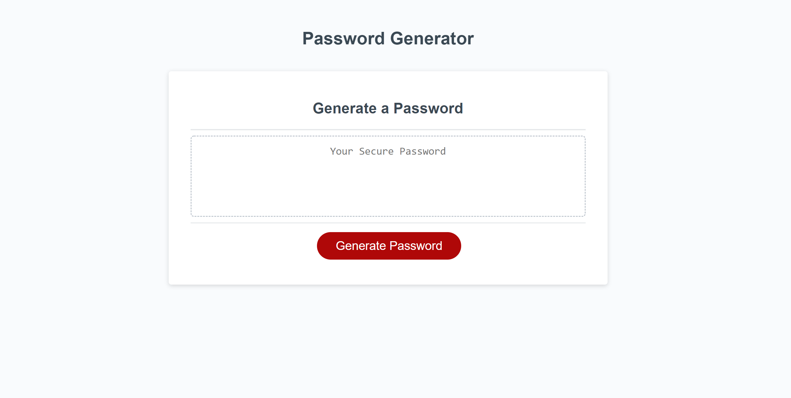

# module-3-challenge
 
## Purpose
Allow user to generate a randomized password containing their desired character types.

## Built With
* HTML
* CSS
* JavaScript

# Website
https://ldholl.github.io/module-3-challenge/ 

## Deployment Screenshot

## Contribution
Created by Lacy Holleman